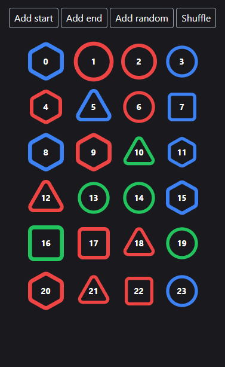

[](https://crates.io/crates/leptos_animate)

Animation utilities for [Leptos](https://github.com/leptos-rs/leptos). FLIP, in/out transitions, and helpers for custom animations.

<details>
    <summary>Preview</summary>
    <p align="center">
        
    </p>
</details>

## ⚠️ Setup

The crate utilizes [unstable web-sys APIs](https://rustwasm.github.io/wasm-bindgen/web-sys/unstable-apis.html). In addition to importing the package, you need to explicitly opt-in to the unstable features via rustflags. The recommended approach is to use a [Cargo configuration file](https://doc.rust-lang.org/cargo/reference/config.html):

```toml
# .cargo/config.toml
[build]
rustflags = ["--cfg=web_sys_unstable_apis"]
```

## Features

### FLIP

[FLIP](https://aerotwist.com/blog/flip-your-animations/) technique is the first-class citizen in this crate. It allows you to animate elements that have been moved due to reordering or addition/removal of other nodes in the DOM.

Example:

```rust
use leptos::prelude::*;
use leptos_animate::{animate, animations::flip::Flip};

#[component]
fn some_component() -> impl IntoView {
    let items = RwSignal::new((0..10).collect::<Vec<_>>());
    view! {
        <For each=move || items.get() key=|item| *item let:item>
            <div use:animate=Flip::watch(items)>
                {item}
            </div>
        </For>
    }
}
```

The directive checks for changes in the DOM when a signal passed to `Flip::watch` is updated. Therefore, always make sure that the animated elements are provided with the same trackable primitive that powers their rendering logic.

Configuration:

```rust
view! {
    <For each=move || items.get() key=|item| *item let:item>
        <div
            use:animate=Flip::watch(items)
                .delay(Duration::from_millis(100))
                .duration(Duration::from_secs(1))
                .easing(easing::cubic_out)
        >
            {item}
        </div>
    </For>
}
```

- `delay` - self-explanatory, no delay by default.

- `duration` - can be either a fixed duration or a function that takes the total distance an element is going to travel and returns the move duration for that specific element. Such a function is used by default, so it may often not fit your use case.

- `easing` - you can pass a custom function to generate animation keyframes or use one of the provided by the library. The default is `easing::cubic_out`.

### Custom CSS classes on enter/leave

A common use case is to animate elements when they enter or leave the DOM. This can be done via CSS classes in combination with `animations::classes` module.

Example utilizing Tailwind CSS:

```rust
use leptos::prelude::*;
use leptos_animate::{animate, animations::classes};

#[component]
fn some_component() -> impl IntoView {
    let visible = RwSignal::new(true);
    view! {
        <Show when=move || visible.get()>
            <div
                use:animate=In::default()
                    .source("opacity-0")
                    .active("duration-150")
                    .target("opacity-100")
            >
                // ...
            </div>
        </Show>
    }
}
```

In this example, the element is initially rendered with `opacity-0` and `duration-150` classes. A frame later, `opacity-0` is removed and `opacity-100` takes its place. Both remaining classes (`duration-150` and `opacity-100`) are removed once the animation is finished.\
In most scenarios, specifying `target` is unnecessary as removing the starting class should be sufficient to transform the element to its final state.

To sum this up:

- `source` - initial classes added before the element is inserted and removed one frame after.

- `active` - applied during the entire entering phase and removed once the animation is finished.

- `target` - classed added one frame after the element is inserted and removed once the animation is finished.

There are 2 more noteworthy options when defining such a behavior:

- `delay` - additional time before `source` classes are removed and `target` classes are added.

- `duration` - defines when the animation is considered finished:

  - fixed duration

  - (default) hook on `transitionend` event

  - hook on `animationend` event

  - a custom function returning `Future` that is being awaited

  - hook on `finish` event on each present [Animation](https://developer.mozilla.org/en-US/docs/Web/API/Animation) for the element

Animating elements leaving the DOM works in a similar fashion:

```rust
use leptos::prelude::*;
use leptos_animate::{animate, animations::classes::Out};

#[component]
fn some_component() -> impl IntoView {
    let visible = RwSignal::new(true);
    view! {
        <Show when=move || visible.get()>
            <div
                use:animate=Out::default()
                    .source("opacity-100")
                    .active("duration-150")
                    .target("opacity-0")
            >
                // ...
            </div>
        </Show>
    }
}
```

In this case, when the element is removed from the DOM, it is being reinserted with `opacity-100` and `duration-150` classes. In the next frame, `opacity-100` is removed and `opacity-0` is added. Once the animation is done, the "zombie" element is removed.

You are free to mix multiple animations together:

```rust
use leptos::prelude::*;
use leptos_animate::{animate, animations::{classes::{In, Out}, flip::Flip}};

#[component]
fn some_component() -> impl IntoView {
    let items = RwSignal::new((0..10).collect::<Vec<_>>());
    view! {
        <For each=move || items.get() key=|item| *item let:item>
            <div
                use:animate=(
                    Flip::watch(items),
                    In::default()
                        .source("opacity-0")
                        .active("duration-150"),
                    Out::default()
                        .active("duration-150")
                        .target("opacity-0")
                )
            >
                {item}
            </div>
        </For>
    }
}
```

### Predefined animations

Common animations will be added to the crate over time, which should simplify setup in most cases.\
For example, you need a simple FLIP list with fade-in/out transitions:

```rust
use leptos::prelude::*;
use leptos_animate::{animate, animations::{fade::{In, Out}, flip::Flip}};

#[component]
fn some_component() -> impl IntoView {
    let items = RwSignal::new((0..10).collect::<Vec<_>>());
    view! {
        <For each=move || items.get() key=|item| *item let:item>
            <div
                use:animate=(
                    Flip::watch(items),
                    In::default(),
                    Out::default()
                )
            >
                {item}
            </div>
        </For>
    }
}
```

Check the `animations` module for available animations and their respective configuration.

### Custom animations

The crate aims to help you define your own animation in a organized way:

```rust
use std::time::Duration;
use leptos::web_sys::HtmlElement;
use leptos_animate::{
    animation::{listeners, Animation, Initializer},
    easing::elastic_out,
    impl_empty_animation_listeners,
    utils::spawn_animation,
};

// Create an initializer for your animation. It can provide configuration options if needed.
#[derive(Clone)]
pub struct RotateIn;

// Once the element is being rendered, the initializer will be called and should create
// the actual animation listening for various events and operating on the node.
impl Initializer for RotateIn {
    fn init_animation(self, element: HtmlElement) -> impl Animation {
        RotateInAnimation { element }
    }
}

// Define the animation's state - usually, it will be the element and potentially some
// behavior configuration.
struct RotateInAnimation {
    element: HtmlElement,
}

// Implement the animation logic - what should happen on which event.
// In this case, we want to append an animation the moment the element is rendered.
impl listeners::BeforeEnter for RotateInAnimation {
    fn listening_for_before_enter(&self) -> bool {
        true
    }

    fn on_before_enter(&mut self) {
        // The helper takes care of generating the keyframes and applying them to the element.
        spawn_animation()
            .element(&self.element)
            .keyframe(|t| {
                vec![
                    ("opacity".into(), t.to_string()),
                    (
                        "transform".into(),
                        format!("rotate({}deg)", (1.0 - t) * 180.0),
                    ),
                ]
            })
            .duration(Duration::from_millis(1600))
            .easing(elastic_out)
            .call();
    }
}

// You need to implement all of the supported listeners to fulfill the trait bounds.
// Empty implementation specifies that the event will be ignored.
impl listeners::Enter for RotateInAnimation {}

// And there is also a helper macro to reduce the boilerplate.
impl_empty_animation_listeners!(
    RotateInAnimation;
    ImmediateEffect,
    Effect,
    Mutation,
    ParentMutation,
    EnterAnimationsFinished,
    MutationAnimationsFinished,
    ParentMutationAnimationsFinished,
    Cleanup
);

impl Animation for RotateInAnimation {}
```

Then you can use it in combination with the `animate` directive:

```rust
#[component]
fn some_component() -> impl IntoView {
    let visible = RwSignal::new(true);
    view! {
        <Show when=move || visible.get()>
            <div use:animate=RotateIn>
                // ...
            </div>
        </Show>
    }
}
```

## Notes

- The crate is in its early stages, so expect some more or less breaking changes in the future.\
  If you have any suggestions or ideas, feel free to open an issue or a PR.

- The recommended way to use the utilities is via custom high-level wrappers that would encapsulate common configurations across your codebase. For example:

  ```rust
  use leptos::prelude::*;
  use leptos_animate::{
      animate,
      animation::Initializer,
      animations::{fade::{In, Out}, flip::Flip},
      utils::Trackable
  };
  use std::time::Duration;

  fn my_flip(items: impl Into<Trackable>) -> impl Initializer  {
      (
          Flip::watch(items).duration(Duration::from_secs(1)),
          In::default(),
          Out::default()
      )
  }

  #[component]
  fn my_list() -> impl IntoView {
      let items = RwSignal::new((0..10).collect::<Vec<_>>());
      view! {
          <For each=move || items.get() key=|item| *item let:item>
              <div use:animate=my_flip(items)>
                  {item}
              </div>
          </For>
      }
  }
  ```

- There are [examples](https://github.com/brofrain/leptos-animate/blob/main/examples) if you need more help with the setup.

## Leptos compatibility

| Crate version | Compatible Leptos version |
| ------------- | ------------------------- |
| 0.1.x         | 0.8.x                     |
